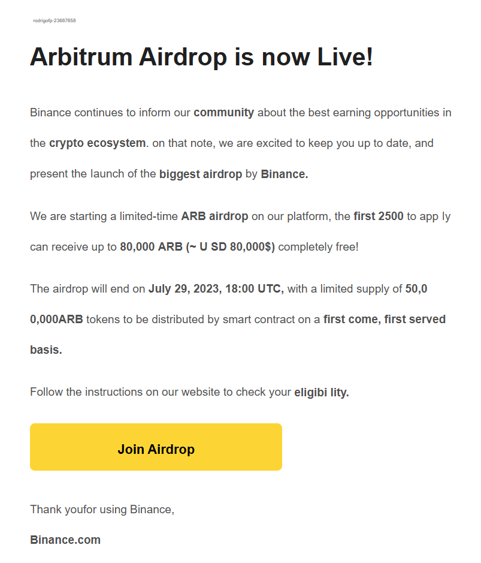
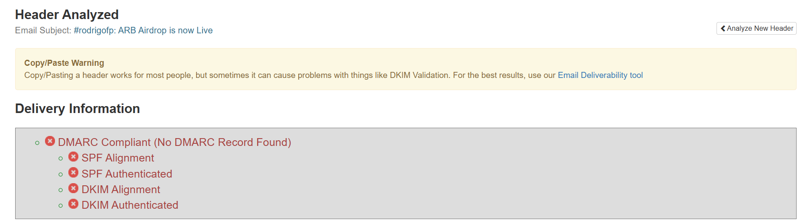

# Task2-Analyze-a-Phishing-Email-Sample.
Internship at Elevate Labs (Task 2)

# Phishing Email Analysis Report

## Sample Source
The phishing email sample was obtained from:  
[rf-peixoto/phishing_pot](https://github.com/rf-peixoto/phishing_pot) → `sample-1006.eml`

---

## Steps Followed
1. **Obtain a sample phishing email**  
   - Collected a phishing email with the subject: **"ARB Airdrop is now Live"**, impersonating Binance.

2. **Examine sender's email address for spoofing**  
   - Claimed sender: `BinanceMail <onmailcloud.onmicrosoft.com>`  
   - Legitimate Binance emails come from `@binance.com`.  
   - ✅ **Spoofing detected.**

3. **Check email headers for discrepancies**  
   - Used **MXToolbox Header Analyzer**.  
   - Findings:  
     - ❌ **No DMARC record found**  
     - ❌ **SPF alignment failed**  
     - ❌ **DKIM authentication failed**  
   - Indicates the email is not properly authenticated.
   - 

4. **Identify suspicious links or attachments**  
   - Body contained links related to **airdrop/verification**.  
   - URLs are **not Binance official domains**.  
   - Potential credential harvesting.
   - Phishing Link:
https://click.pstmrk.it/3s/sweedbuy.com%2Fblog%2F/ahc/k_CuAQ/AQ/44a54f89-410d-4729-b21c-32c30d6eb945/1/qOoKiS9V1s?/23687658rodrigofp
 (currently not available)

5. **Look for urgent or threatening language**  
   - Subject: *"ARB Airdrop is now Live"*  
   - Creates urgency to click quickly and claim tokens.  
   - ✅ **Social engineering tactic.**

6. **Note any mismatched URLs**  
   - Visible text suggested Binance, but hover shows unrelated domain.  
   - Classic phishing indicator.

7. **Verify presence of spelling or grammar errors**  
   - The message included odd formatting and inconsistent style.  
   - "eligibi lity" instead of "eligibility"
   - "Thank youfor using Binance," instead of "Thank you for using Binance,"
   - "app ly" instead of "apply"
   - Extra spaces, inconsistent punctuation, and odd line breaks

8. **Summarize phishing traits found**
   - Spoofed sender domain.  
   - Fails DMARC/DKIM/SPF authentication.  
   - Suspicious links to non-Binance domains.  
   - Urgent/enticing message (airdrop).  
   - Possible grammar/style issues.  

---

## **Conclusion**
This email is a **phishing attempt** masquerading as Binance.  
- It leverages **urgency (airdrop live)** and **spoofed sender details** to trick users.  
- Header analysis confirms **lack of proper authentication (DMARC/DKIM/SPF failures)**.  
- URLs point to suspicious domains, not the legitimate Binance site.  

👉 Always verify the sender domain, check headers, and hover over links before clicking.

